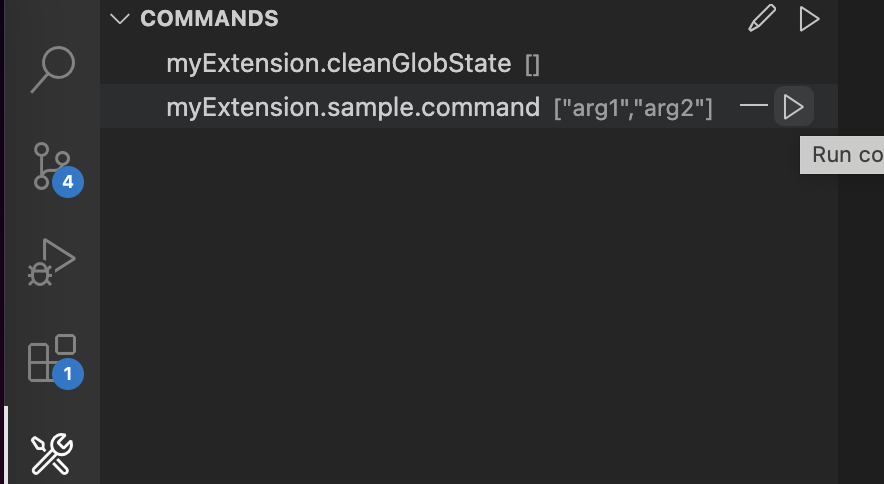
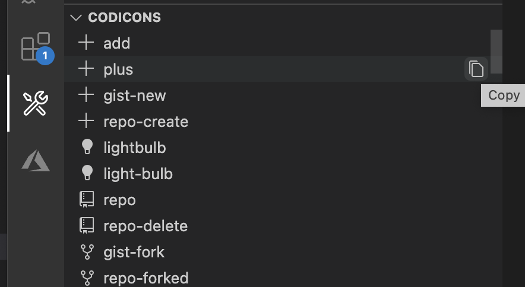
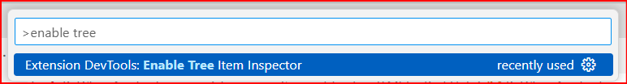
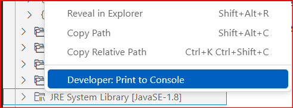

# VS Code Extension Dev Tools

This extension helps you develop VS Code extensions, providing convenient utilities.

## Run Commands
It helps you easily run/test custom commands during extension development.

## Pick Codicons
View all available Codicons, shortcut to copy id.

## Inspect Tree Items
Enable Tree Item Inspector from Command Palette.

Right click on the tree item you want to inspect, select `Developer: Print to Console`. Then you will see the object printed to Developer Console.

